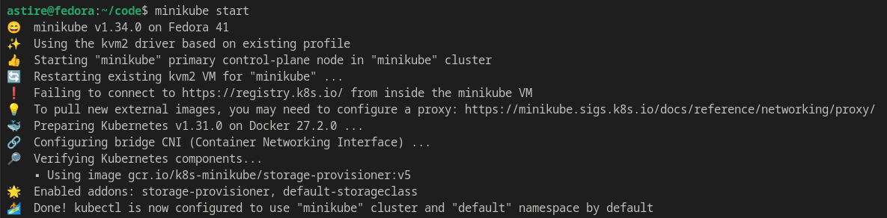
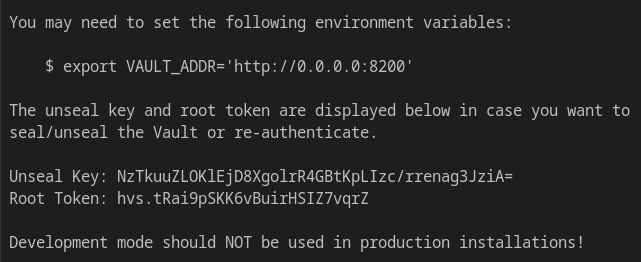
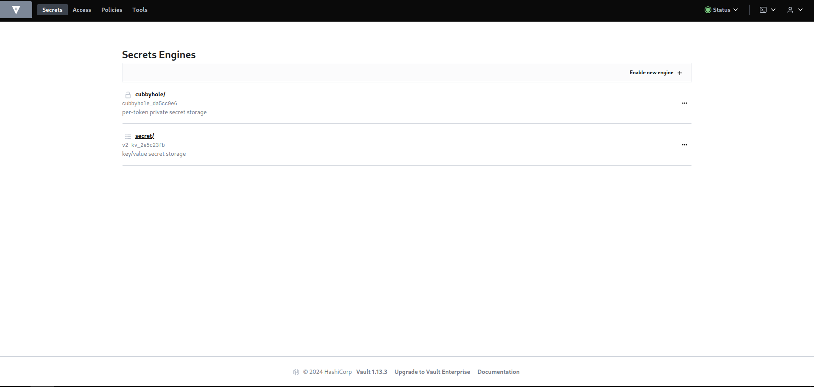
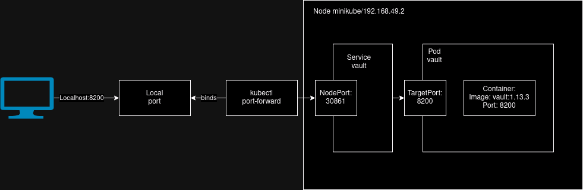

# Info

University: [ITMO University](https://itmo.ru/ru/)  
Faculty: [FICT](https://fict.itmo.ru)  
Course: [Introduction to distributed technologies](https://github.com/itmo-ict-faculty/introduction-to-distributed-technologies)  
Year: 2024/2025 
Group: K4112C  
Author: Zinchenko Andrey Sergeevich  
Lab: lab1-lab4  
Date of create: 1.12.2024  
Date of finished: - 5.12.2024 

# Ход Работы

1) Устанавливаем Minikube используя [оригинальную инструкцию](https://minikube.sigs.k8s.io/docs/start/?arch=%2Flinux%2Fx86-64%2Fstable%2Fbinary+download)
2) После выполнения команды ```minikube start``` можно увидеть следующий вывод об успешном запуске:

3) Авторизуемся в Docker с помощью ```docker login``` — это необходимо, чтобы избежать ошибок: _ErrImagePull_ или _ImagePullBackOff_.
4) Запускаем под с помощью ```kubectl create -f myfirst.yaml``` или ```kubectl apply -f myfirst.yaml```
5) Делаем кластер доступным снаружи с помощью:

```bash
minikube kubectl -- expose pod vault --type=NodePort --port=8200
```

6) Настраиваем проброс порта, чтобы обращаться напрямую через localhost без необходимости знать реальный IP:

```bash
minikube kubectl -- port-forward service/vault 8200:8200
```

P.S. Можно использовать ```minikube service vault --url``` для прямого обращения к сервису.

7) Получаем токен для входа с помощью ```kubectl logs vault```



8) Вводим токен в хранилище и попадаем на главную страницу Vault.



# Схема



Таким образом запросы к localhost:8200 сначала попадают на локальный порт, а затем перенаправляются на сервис Vault и далее на контейнер внутри пода, который слушает на том же порту.