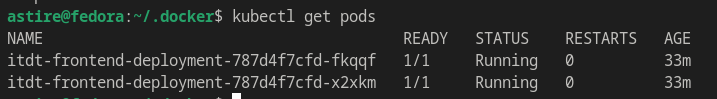
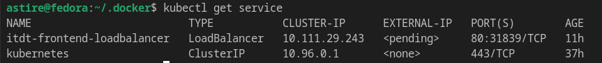
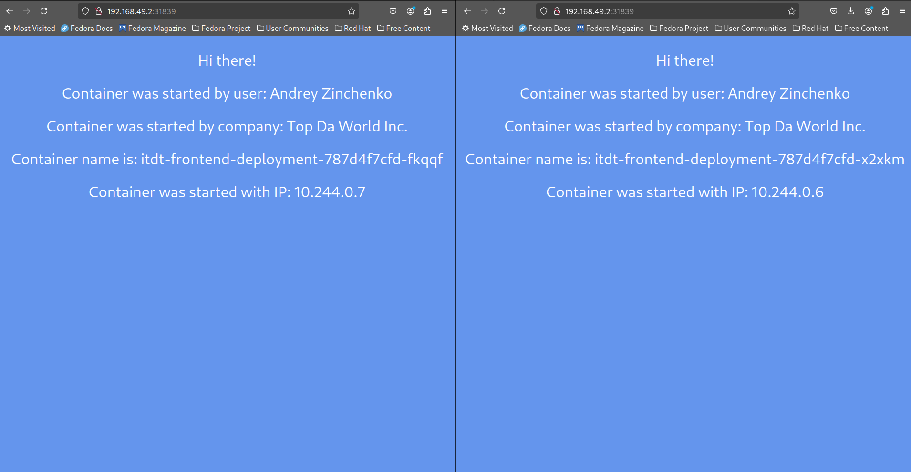
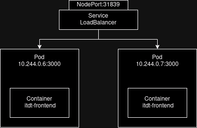

# Info

University: [ITMO University](https://itmo.ru/ru/)  
Faculty: [FICT](https://fict.itmo.ru)  
Course: [Introduction to distributed technologies](https://github.com/itmo-ict-faculty/introduction-to-distributed-technologies)  
Year: 2024/2025 
Group: K4112C  
Author: Zinchenko Andrey Sergeevich  
Lab: lab1-lab4  
Date of create: 4.12.2024  
Date of finished: -  

# Ход Работы

1) Написаны 2 yaml файла: [deploymet.yaml](deployment.yaml) и [service.yaml](service.yaml)
2) Для запуска были выполенны следущие команды:

```bash
$ kubectl apply -f deployment.yaml
$ kubectl apply -f service.yaml
```

3) Проверим, что были запущены 2 реплики:



4) Проверяем запущенный сервис:



5) Для доступа к сервису можно воспользоваться ```minikube service itdt-frontend-loadbalancer --url```, после чего получаем следующий вывод:

```bash
$ minikube service itdt-frontend-loadbalancer --url
http://192.168.49.2:31839
```

6) Переходим на url:



Как видим переменные - REACT_APP_USERNAME, REACT_APP_COMPANY_NAME остастся прежними так как используются приложением для настройки окружения, в то время как имя контейнера меняется поскольку оно уникально идентифицирует конкретный контейнер внутри кластера.

7) Таким образом схема взаимодействия сервиса и подов выглядит следующим образом:



Логи: [Logs](/lab2/logs/)