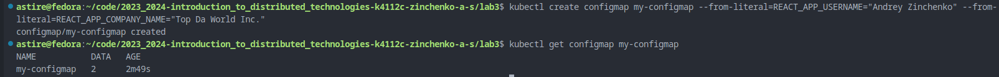
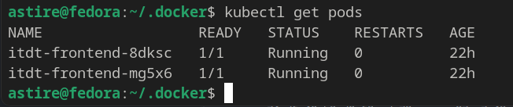
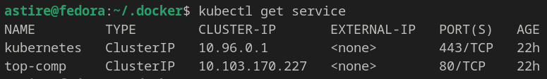
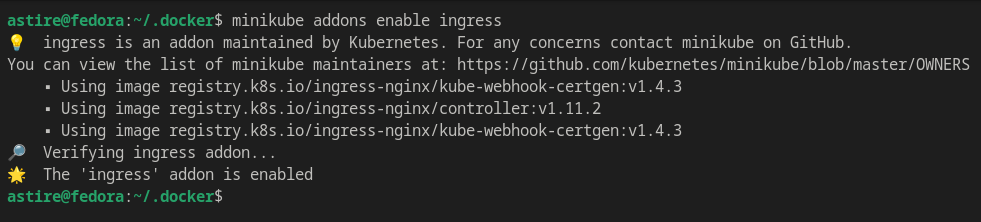
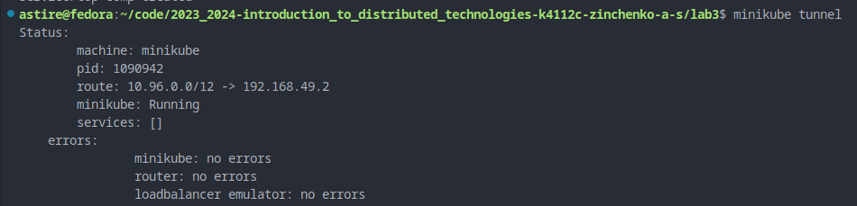
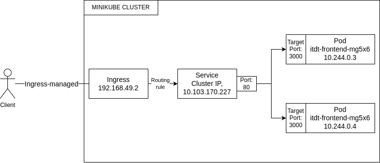

# Info

University: [ITMO University](https://itmo.ru/ru/)  
Faculty: [FICT](https://fict.itmo.ru)  
Course: [Introduction to distributed technologies](https://github.com/itmo-ict-faculty/introduction-to-distributed-technologies)  
Year: 2024/2025 
Group: K4112C  
Author: Zinchenko Andrey Sergeevich  
Lab: lab1-lab4  
Date of create: 8.12.2024  
Date of finished: 12.12.2024

# Ход Работы

1) Для создания ConfigMap можно использовать:
- использовать команду:
```bash
kubectl create configmap my-configmap \
--from-literal=REACT_APP_USERNAME="Andrey Zinchenko"  \
--from-literal=REACT_APP_COMPANY_NAME="Top Da World Inc."
```

  

- ИЛИ создать конфиг yaml и применить его через ```kubectl apply -f configmap.yaml```

2) Создаем 👉 [ReplicaSet](replicaset.yaml) и применяем его ```kubectl apply -f replicaset.yaml```



3) Создаем 👉 [Service](service.yaml) и применяем его ```kubectl apply -f service.yaml``` 



4) Включаем ingress ```minikube addons enable ingress``` 



5) Создаем сертификат с помощью 
```bash
openssl req -x509 -nodes -days 365 -newkey rsa:2048 -keyout tls.key -out tls.crt -subj "/CN=top-comp.ru" -addext "subjectAltName = DNS:top-comp.ru"
```
и генерируем секрет 
```bash
kubectl create secret tls top-comp-tls --cert=tls.crt --key=tls.key
```

6) Создаем 👉 [Ingress](ingress.yaml) и применяем его ```kubectl apply -f ingress.yaml``` 

7) Создаем туннель  ```minikube tunnel```



8) Добавляем в /etc/hosts строку: ```<minikube_ip> top-comp.ru``` в моем случае ```192.168.49.2 top-comp.ru```

9) Переходим в https://top-comp.ru и видим сайт


10) Проверяем, что сертификат применился для этого нажимаем на ["Certificate details"](top-comp.ru)


Как видим серийный номер сертификата на сайте - __0F:1E:E2:F7:B3:9A:EE:43:3D:2B:D9:F2:64:46:7E:D3:0A:73:30:16__. Вводим ```openssl x509 -in tls.crt -text -noout``` и получаем тот же номер сертификата: __0f:1e:e2:f7:b3:9a:ee:43:3d:2b:d9:f2:64:46:7e:d3:0a:73:30:16__. Это говорит нам о том, что все правильно сделано


11) При вводе top-comp.ru в браузере, запрос сначала ищет соответствие в файле hosts. Если запись найдена (192.168.49.2 top-comp.ru), запрос перенаправляется на IP-адрес 192.168.49.2 Minikube. Если запись не найдена, запрос перенаправляется через minikube tunnel, который также сопоставляет top-comp.ru с IP-адресом Minikube.  
Затем запрос попадает на Ingress Controller, который использует правила Ingress для перенаправления запроса на сервис top-comp. Сервис top-comp использует селектор app: itdt-frontend, чтобы выбрать под itdt-frontend для обработки запроса. Kubernetes выбирает под случайным образом с помощью алгоритма RoundRobin. Выбранный под обрабатывает запрос и отправляет ответ обратно в Ingress Controller, который передает его обратно в браузер через minikube tunnel или hosts

