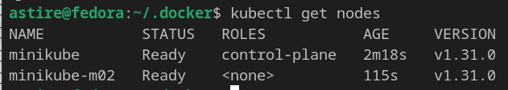
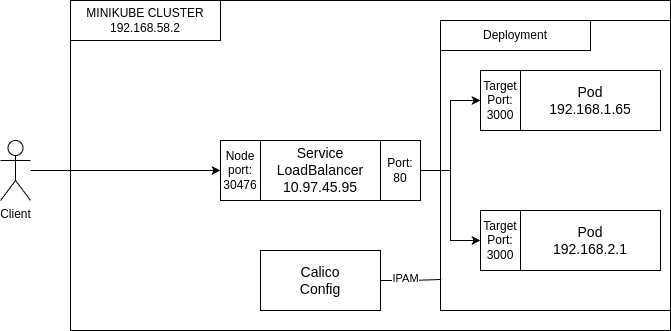

# Info

University: [ITMO University](https://itmo.ru/ru/)  
Faculty: [FICT](https://fict.itmo.ru)  
Course: [Introduction to distributed technologies](https://github.com/itmo-ict-faculty/introduction-to-distributed-technologies)  
Year: 2024/2025 
Group: K4112C  
Author: Zinchenko Andrey Sergeevich  
Lab: lab1-lab4  
Date of create: 14.12.2024  
Date of finished: - 

# Ход Работы

1) Запуск minikube с помощью ```minikube start --driver=docker --cni=calico --nodes 2```




2) Назначаем метки

```bash
$ kubectl label node minikube rack=rack-m01
$ kubectl label node minikube-m02 rack=rack-m02
```


3) Удаляем стандартный пул ```minikube kubectl -- delete ippools default-ipv4-ippool```

4) Устанавливаем calico как плагин kubectl:

```bash
curl -L https://github.com/projectcalico/calico/releases/download/v3.29.1/calicoctl-linux-amd64 -o kubectl-calico
```

```bash
chmod +x kubectl-calico
```


5) Создаем 👉 [свой ip-pools](ippool.yaml) и применяем его ```kubectl calico apply -f ippool.yaml --allow-version-mismatch```


6) Создаем 👉 [Deployment](deployment.yaml) и применяем его ```minikube kubectl -- apply -f deployment.yaml```

7) Создаем 👉 [Service](service.yaml) и применяем его ```minikube kubectl -- apply -f service.yaml```

8) Проверяем сервис и поды


9) Пингуем с пода itdt-frontend-deployment-787d4f7cfd-jlcnt под itdt-frontend-deployment-787d4f7cfd-mth2q  

```bash
kubectl exec itdt-frontend-deployment-787d4f7cfd-jlcnt -- ping -c 5 192.168.2.1
```


11) Схема:

